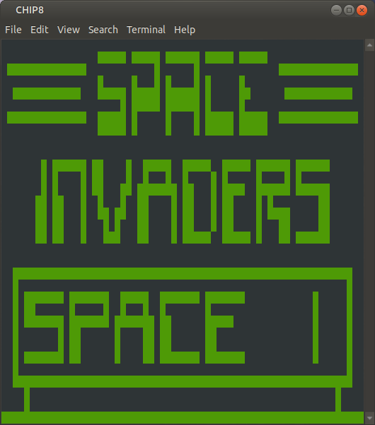
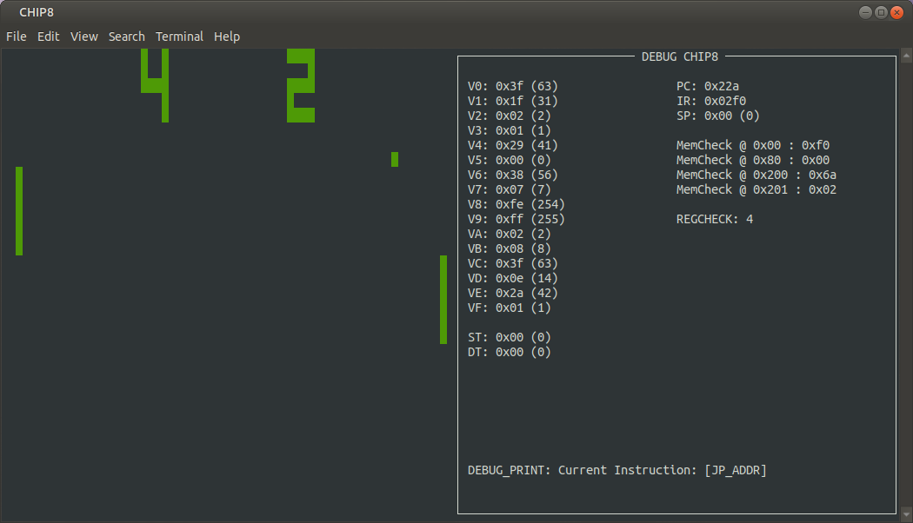
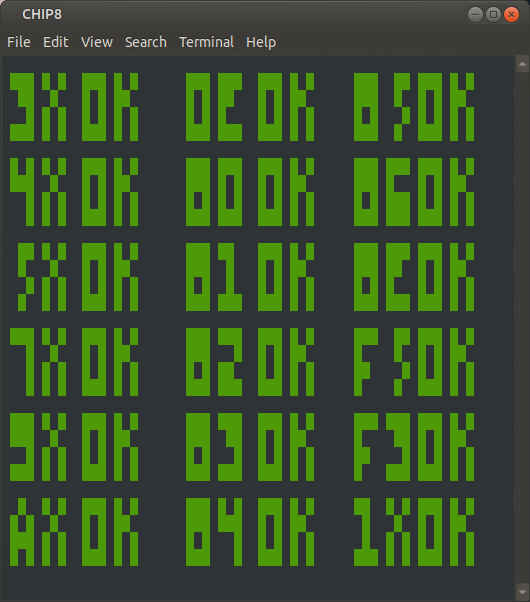

<h1 align="center">CHIP8 Interpreter</h1>

<p align="center">
    
    
    
    
</p>

<br>

<p align="center"></p>

CHIP8 is an interpreted language that runs on a virtual machine. It was invented in the mid 1970s to allow video games to be more easily programmed for computers at that time. You can view the CHIP8 instruction set [here](https://github.com/mattmikolay/chip-8/wiki/CHIP%E2%80%908-Instruction-Set).

This CHIP8 interpreter was written in C using the *ncurses* library. Additionally, it comes with a DEBUG mode where you can view the state of the virtual machine while running a CHIP8 program.

<p align="center"></p>


## Testing

This interpreter passes all of the opcode tests.

<p align="center"></p>

## Building and Running

In order to build the project, you will need to have ncurses installed.

```bash
sudo apt-get install libncurses5-dev libncursesw5-dev
```

Once ncurses is installed, you can run use the following command to build the project.

```bash
make build
```

There are some test ROMs in the `/roms` folder. Once the project has been compiled, you can use the following command to run it with a ROM.

```bash
chip8 ./path/to/rom.ch8
```

Additionally, you can pass the `-d` flag to run the the interpreter in debug mode to step through the ROM in a debug mode.

```bash
chip8 -d ./path/to/rom.ch8
```
